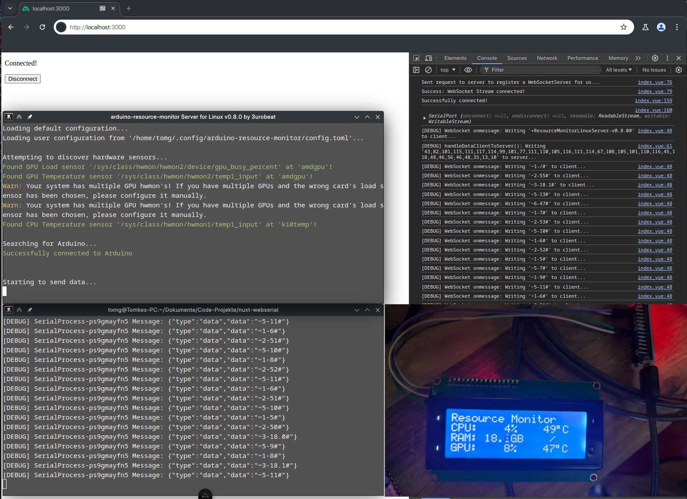

# nuxt-webserial
This is a demo project featuring a full implementation of a bidirectional serial communication between a client USB device and a Linux mount point using NuxtJS.  

The client USB device is connected using WebSerial (sadly requires a Chromium Browser).  
The page loaded in the browser handles passing data between the WebSocket and WebSerial connection.  
On the server side a child process is spawned, which creates a virtual mount point (`ttyVIRT0 <-> ttyVIRT1`) using `socat`, reads and writes data to and from it, and passes it back to the WebSocket.

Any process on the Linux server is now able to communicate with the device connected to the client machine by interfacing with `ttyVIRT0`. 

In total, this project should get you an understanding of how you can transfer serial data over the web.  
This is by no means a perfect implementation and is not safe in this state (no authentication, no encryption, no safety measures).  
It should serve you as a starting point for your own project.

Open the browser console to get more information when connecting.

&nbsp;

## Demo

This demo shows my [arduino-resource-monitor project](https://github.com/3urobeat/arduino-resource-monitor) communicating with the connected Arduino Nano through the nuxt-webserial server.  

The Arduino Nano *(bottom right)* is connected to the browser *(background)*, which shows the page of the nuxt-webserial server *(bottom left)*.  
The arduino-resource-monitor server *(middle left)* sends data to the mountpoint created by the nuxt-webserial server, leading to the data arriving at the Arduino Nano and being displayed.  
The data being transmitted can be seen in the logs at the bottom left and background right.

This is all happening on the same machine only for this demo image. The whole point of this project is of course that you are able to stream over a server located *somewhere*.

&nbsp;

## Project Structure
### model
Contains TypeScript type definitions.

### pages
Contains vue pages loaded on the client side by the browser.  
The file `index.vue` handles creating a WebSerial connection and maintaining a websocket connection with the server.  
It listenes for data from the serial device or the websocket and passes data around between the two.

### server
Contains files loaded on the server side.  

The file `serialDevice.ts` handles spawning `mounts/serialService.mjs` and handling communication between it and the websocket.

**middleware:**  
The file `serialWebsocket.ts` handles creating a WebSocketServer to allow websocket communication with the client.  
It accepts data from `serialDevice.ts` and `index.vue` and passes data around between the two.

**mounts:**  
Contains mount points for the mounted serial devices, each device mount in a subdirectory named by ID.  
The file `serialService.mjs` is spawned as a child process by `serialDevice.ts` and handles creating and interfacing with virtual mount points on the Linux server.  
This is required because we cannot directly interface with mount points from the nuxt process without running into a V8 engine missing lock exception.

The mount points it creates are `ttyVIRT0` and `ttyVIRT1`. Other processes can interact with `ttyVIRT0`, the serialService interacts with the other side of the loopback `ttyVIRT1`.

### /
Entry point `app.vue`.
